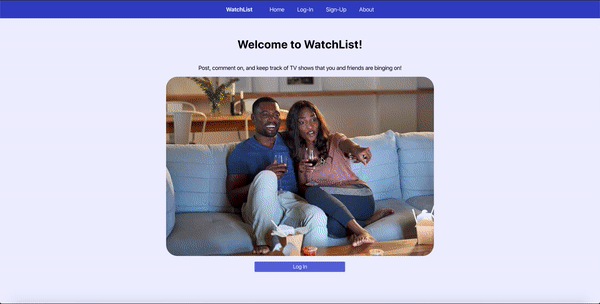

# Watchlist

Watchlist is a full-stack application where users can post, comment on, and favorite TV shows that they are binging on.

## Features
- Users can **add shows** that they watch. These shows are shared on their profile pages.
- Users can view the profile pages of other users.
- Users can **add comments** on other users' shows.

## IMPORTANT

Run seedDatabase.js in the front-end folder to seed the database (must have server running)

## Preview

